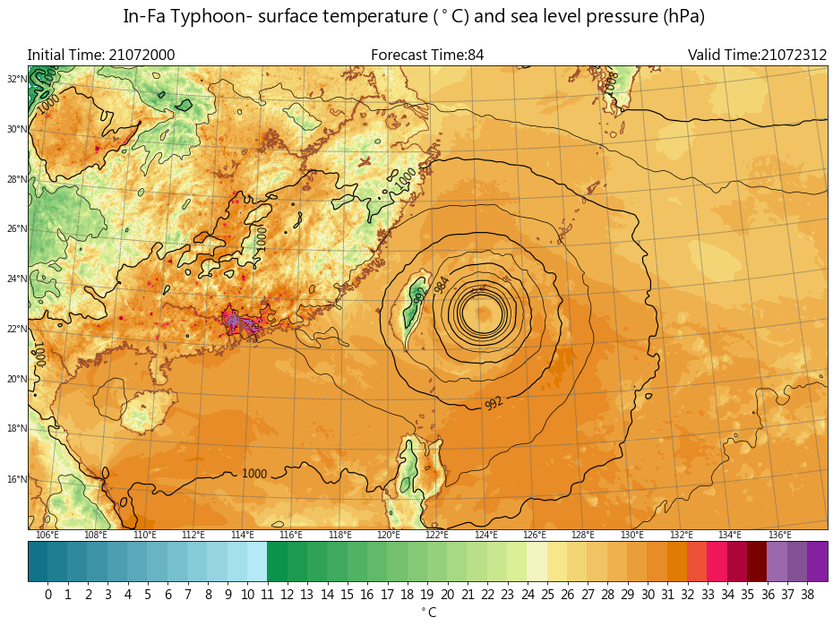

Surface Temperature and sea level pressure
-----

Plotting rainfall contour with wind barb.

CWB regional numerical weather model data are used in this example.

Data format: Grib2

Data source: CWB opendata website

^^^^^

.. code-block:: python

   import numpy as np
   import pygrib as pb
   import matplotlib.pyplot as plt
   from mpl_toolkits.basemap import Basemap
   import cwbplot.cwb_colorbar as cwbcbar

   tau_84 = pb.open("M-A0064-21072000-084.grb2")

   basicvar_84 = tau_84.select()[:]
   lon_0, lat_0 = basicvar_84[0]["LoVInDegrees"], basicvar_84[0]["LaDInDegrees"]
   lat_1, lat_2 = basicvar_84[0]["Latin1InDegrees"], basicvar_84[0]["Latin2InDegrees"]
   lats, lons = basicvar_84[0].latlons()
   proj = Basemap(projection="lcc",resolution='h',lat_0 = lat_0 ,lon_0 = lon_0 ,lat_1 = lat_1, \
           lat_2 = lat_2, llcrnrlat = lats[0,0], llcrnrlon = lons[0,0], urcrnrlat = lats[-1,-1], \
           urcrnrlon = lons[-1,-1])

   analDate = basicvar_84[0].analDate.strftime("%y%m%d%H")
   fcst = str(basicvar_84[0].forecastTime)
   valDate = basicvar_84[0].validDate.strftime("%y%m%d%H")
   temp = basicvar_84[62]["values"] - 273.15
   slp = basicvar_84[76]["values"]/100 #Pa to hPa

   fig = plt.figure(figsize=(16,12))
   tempcbar = cwbcbar.surfT()
   proj.drawcoastlines(linewidth=1, color='sienna')
   ctf = proj.contourf(lons, lats, temp, **tempcbar, latlon=True)

   # line bold and clable in line
   needlabel = proj.contour(lons, lats, slp, np.arange(984,1025,8), linewidths = 1.2, colors = "k",latlon=True)

   #line bold but not clable
   proj.contour(lons, lats, slp, np.arange(960,984,8), linewidths = 1.2, colors = "k",latlon=True)

   #line not bold
   proj.contour(lons, lats, slp, np.arange(964,1025,8), linewidths =0.7, colors = "k",latlon=True)
   plt.clabel(needlabel, fmt = "%d",inline=True, fontsize=12)

   proj.drawmeridians(np.arange(100,141,2), color='dimgray', labels=[0, 0, 0, 1], yoffset = 0 )
   proj.drawparallels(np.arange(10,51,2), color='dimgray', labels=[1, 0, 0, 0], xoffset = 0 )

   cbar = plt.colorbar(ctf,orientation='horizontal',pad=0.02,ticks=tempcbar["levels"][1:-1])
   cbar.ax.tick_params(labelsize=14)
   cbar.set_label("$^\circ$C",size=14)
   plt.title("Initial Time: {}".format(analDate), loc="left",fontsize=16)
   plt.title("Forecast Time:{}".format(fcst),loc="center",fontsize=16)
   plt.title("Valid Time:{}".format(valDate),loc="right",fontsize=16)
   plt.suptitle("In-Fa Typhoon- surface temperature ($^\circ$C) and sea level pressure (hPa)",y=0.93,fontsize=20)

