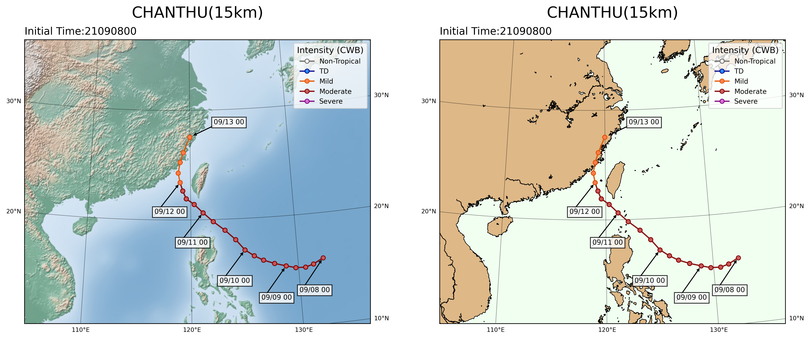

Typhoon Track
-----

Plotting typhoon track. The intensity of typhoon are referred CWB guidence.

Data format: csv

Data source: CWB npd website

^^^^^

.. code-block:: python

   import matplotlib.pyplot as plt
   import pandas as pd
   from mpl_toolkits.basemap import Basemap
   from datetime import datetime, timedelta
   from cwbplot import tytrack

   def draw(proj, dfpath, initime, axpic):
        odtg = [ (initime + timedelta(hours=int(taus))).strftime("%m/%d %H") for taus in dfpath["tau"] ]
        points = dfpath.shape[0]
        for cnt in range(points):
            lineinfo, legendinfo = tytrack.filled(path['Vmax(m/s)'][cnt])
            if cnt != points - 1:
                x1, x2 = dfpath['lon'][cnt],dfpath['lon'][cnt+1]
                y1, y2 = dfpath['lat'][cnt], dfpath['lat'][cnt+1]
            else:
                x1, x2 = dfpath['lon'][cnt], dfpath['lon'][cnt]
                y1, y2 = dfpath['lat'][cnt], dfpath['lat'][cnt]
            proj.plot([x1, x2], [y1, y2], **lineinfo, ax = axpic, latlon = True)
        textposlon, textposlat= bm(list(dfpath["lon"][:]-2.5),list(dfpath["lat"][:]-3))
        pathlon, pathlat = bm(list(dfpath["lon"][:]),list(dfpath["lat"][:]))

        for i in range(0,21,4):    #
            if i == 20:
                textposlon[i], textposlat[i]= bm(dfpath["lon"][i]+2.5, dfpath["lat"][i]+1)
                pathlon[i], pathlat[i] = bm(dfpath["lon"][i], dfpath["lat"][i])

            axpic.text(textposlon[i],textposlat[i],odtg[i],
                       ha='left',va='bottom',fontsize=8,
                       bbox=dict(boxstyle='square',
                           facecolor='white',
                           alpha=0.8,
                           capstyle='round')
                         )

            disx = pathlon[i] - textposlon[i]
            disy = pathlat[i]- textposlat[i]
            rr = 1.15
            if i == 20:
                rr = 1.35
            axpic.arrow(textposlon[i],textposlat[i],disx/rr, disy/rr, head_width=20000, head_length=20000, fc='k', ec='k')
        axpic.set_title("CHANTHU(15km)\n",loc='center',fontsize=18)
        axpic.set_title("Initial Time:21090800",loc='left')
        axpic.legend(*legendinfo, loc="upper right",title="Intensity (CWB)",borderpad=0.5,title_fontsize=10,fontsize=8)

    path = pd.read_csv("tytrack.csv")
    init = datetime.strptime("21090800","%y%m%d%H")
    figs, axss = plt.subplots(1,2,figsize=(16,8),dpi=350)
    bm=Basemap(projection='lcc',lat_1=10,lat_2=40,lat_0=27.06553,lon_0=118.5691,
                 resolution='h',llcrnrlon=105, llcrnrlat=10, urcrnrlon=140, urcrnrlat=35)

    for pics in range(axss.shape[0]):
        bm.drawparallels(np.arange(-90,90,10),  labels=[1,1,0,0], fontsize=7, linewidth=0.5,ax=axss[pics])
        bm.drawmeridians(np.arange(0,180,10), labels=[0,0,0,1], fontsize=7,  linewidth=0.5,ax=axss[pics])
        if pics == 0:
            bm.shadedrelief(ax=axss[pics])
        else:
            axss[pics].set_facecolor("honeydew")
            bm.fillcontinents(color = "burlywood")
            bm.drawcoastlines(linewidth=0.6)
        draw(bm, path, init, axss[pics])
 
 
Track data as follows: 

